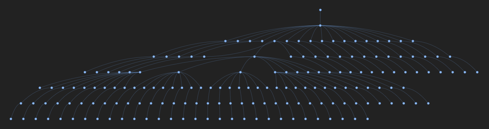

[](https://doi.org/10.5281/zenodo.21340477)

# Overview
This is an auxiliary package for OSLA project at the VU Lab. It parses device location specifications in JSON format and outputs a graph that can be used by the scheduler / orchestrator combo from OpenLabAutomation. The graph is a tree representing the nodes of actual devices (leaf nodes) and intermediate steps along the way (virtual nodes).

The JSON specification has the following format:

```json
{
    "node_name": {
        "origin": "Origin of the node, position format is ['x','y', 'z', 'roll', 'pitch', 'yaw']",
        "plate_path": "The path to a relative plate position, used to pick and drop plates. Going from the entrypoint to posx, relative to the posx",
        "pre_entrypoint": "The path and movement of the gripper before going to the entrypoint, relative to the entrypoint",
        "relatives": {
            "entrypoint": "Where to enter the node relative from the origin",
            "pos1": "A plate position of the node relative to the origin ",
            "posN": "If needed more 'posN' points can be added"
        }
    }
    <devices>
}
```

The `node_name` object gives the schema for specifying device locations, along with an explanation of the meaning of each entry. For instance, a robotic arm might have the following specification:

```json
{
    ...

    "robotarm": {
        "origin": [
            0.0,
            0.0,
            0,
            0,
            0,
            0
        ],
        "relatives": {
            "entrypoint": [
                149.6,
                -0.9,
                238.2,
                180,
                0,
                0
            ],
            "entrypoint_old": [
                160.0,
                0.0,
                200,
                180,
                0,
                0
            ],
            "entrypoint_home": [
                149.6,
                -0.9,
                238.2,
                180,
                0,
                0
            ]
        }
    }

    ...
```

Not all elements are used by the scheduler and the orchestrator. For instance, the above `robotarm` entry would be translated into the following node specification (note that only the `entrypoint` element has been translated):

```gml
[
  ...
  node [
    id 0
    label "robotarm_entrypoint"
    x 149.60000610351562
    y -0.8999999761581421
    z 238.1999969482422
    roll 180.0
    pitch 0.0
    yaw 0.0
  ]
  ...
]
```

The package can be used from the command line or as a library (both outlined below). There is an option to visualise the generated graph with PyVis, which opens a new browser window and displays the graph together with some options to modify the visualisation.



Check out the example in the [tutorial](docs/tutorial.ipynb) to see how `siteparser` can be used as a library.

## CLI

Using `siteparser` from the CLI is straightforward: just pass the JSON file as an argument and specify the name of the output file with `-o` (this is where the graph will be stored). The CLI also supports the visualisation and summarisation options. You can print the supported CLI syntax by just typing `siteparser`:

```
└$> siteparser
Usage: siteparser [OPTIONS] FILE

Positional arguments:
  FILE               The JSON specification to load.

Options:
  -o, --output TEXT  File to save the generated graph to.
  -s, --summarise    Print a summary of the devices found.
  -v, --visualise    Visualise the graph.
  --help             Show this message and exit.
```
